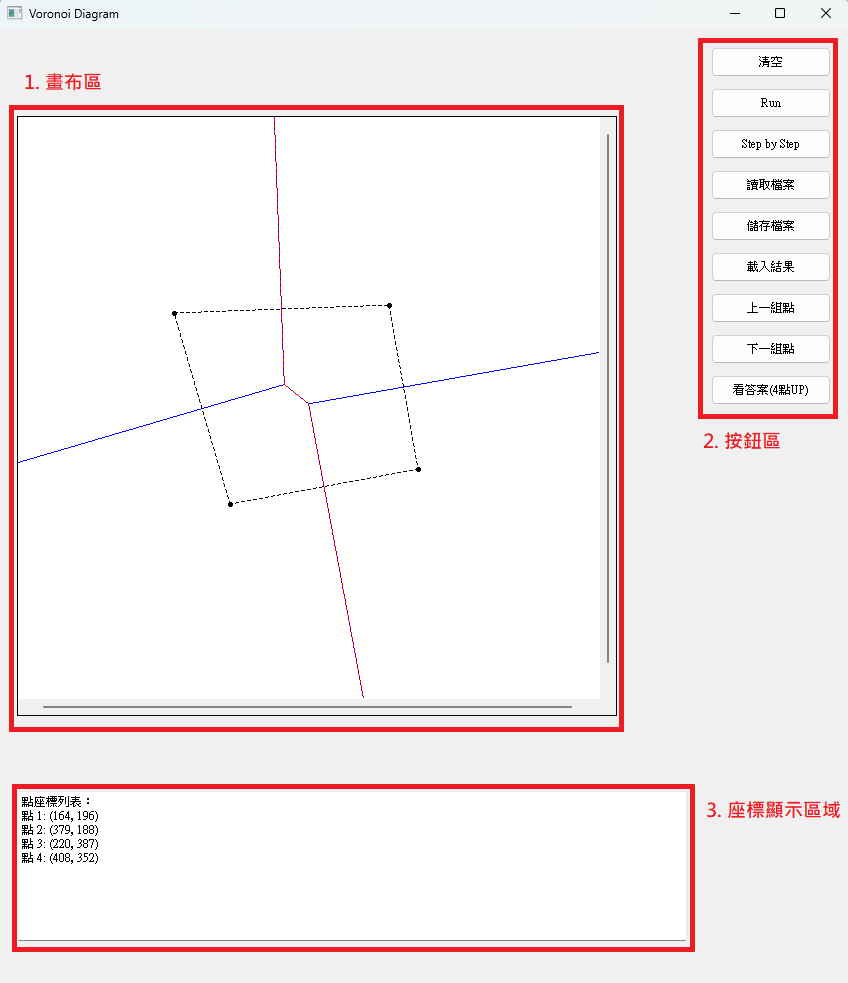

# Voronoi Diagram Term Project

## 系級、姓名與學號
- **系級**: 資安碩一
- **姓名**: 尤心怡
- **學號**: M133140001

---

## 1. 題目
**Voronoi Diagram Term Project**

本專案旨在使用 Python 與 PyQt5 建構一個基於分治法的 Voronoi Diagram 視覺化系統，具備輸入點集、生成對應 Voronoi 圖的功能，並包含分步操作的說明與測試

---

## 2. 軟體規格書

### 輸出與輸入（資料）規格
1. **輸入**:
   - 使用者於畫布上點擊產生的點座標，或由檔案讀取點資料和邊資料
2. **輸出**:
   - 根據輸入點生成的 Voronoi 圖，包含邊的座標資訊，並以視覺化形式呈現
   - 可以儲存畫布上的點和邊資料，輸出資料格式 : 點 P x y，邊 E x1 y1 x2 y2，座標點以 lexical order順序排列（即先排序第一維座標，若相同，則再排序第二維座標；線段亦以 lexical order 順序排列

### 功能規格與介面規格

- 畫布區域 : 使用者可以用滑鼠在畫布區域中點擊來產生點
- 按鈕區域 :
  - 「Run」按鈕 : 根據畫布上的點產生 Voronoi 圖
  - 「清空」按鈕 : 可以清除畫面上的點和邊
  - 「Step by Step」按鈕 : 逐步展示 Voronoi 圖生成過程
  - 「讀取檔案」按鈕 : 讀入測試點資料
  - 「儲存檔案」按鈕 : 儲存畫布上的點和邊資料
  - 「載入結果」按鈕 : 讀入結果資料(點和邊)
  - 「下一組點」按鈕 : 讀入多筆資料時使用，可以看下一筆資料
  - 「上一組點」按鈕 : 讀入多筆資料時使用，可以看上一筆資料
  - 「看答案(4點UP)」按鈕 : 直接使用 scipy 套件觀看正確的 Voronoi Diagram
- 座標顯示區域 : 會顯示畫布上點的(x,y)座標

### 目前程式可以解出情況
- 1~3 點 : 直接去計算中垂線即可
- 4~5 點 : 使用 divide-and-conquer 方式，正常情況和共線可以解出來，特殊情況不行
- 所有點共線情況
- 
---

## 3. 軟體說明

### 安裝需求
- Python 環境安裝完整，並包含以下套件：
  - **PyQt5**
  - **SciPy**
  - **numpy**

### 使用方式
1. 啟動程式後，於畫布點擊產生點資料 
2. 使用者也可以按下「讀取檔案」和「載入結果」按鈕來賭檔  
3. 按下「Run」按鈕，會根據畫布上的點產生對應的 Voronoi Diagram 
4. 按下「Step by Step」按鈕，會逐步展示 Voronoi 圖生成過程 
5. 按下「儲存檔案」按鈕，可以儲存畫布上的點和邊資料 

---

## 4. 程式設計

### 三點以下
對於三點以下的情況，直接計算三點的外心和中垂線即可找到 Voronoi Diagram
1. **1 點的情況** : 一個點的 Voronoi Diagram 是整個平面 
2. **2 點的情況** : 根據兩個點計算垂直平分線的方向向量，將平分線延伸，生成對應的邊 
3. **3 點的情況** : 
   - 共線 : 直接計算所有點的垂直平分線
   - 不共線 : 計算三角形外心並生成 Voronoi Diagram，邊的方向是由方向向量和點的內積所決定的 

### 核心演算法
1. **分治法 (Divide-and-Conquer)**:
   - 利用遞迴分割點集，左右分別生成 Voronoi 圖，並進行合併。
2. **Convex Hull**:
   - 採用 Andrew's monotone chain 演算法，找出上下凸包以輔助合併過程。
3. **Hyperplane**:
   - 利用中垂線找出上下切線與合併過程中的邊界。

### 改良之處
- 分步演示與結果視覺化。
- 提供共線點的特殊處理，避免異常情況。

---

## 5. 軟體測試與實驗結果

### 測試環境
- **硬體**:
  - CPU: Intel i5-10300H
  - RAM: 32GB
- **作業系統**: Windows 11
- **開發工具與版本**:
  - Python 3.10
  - PyQt5 5.15.11
  - numpy 1.24.4
  - scipy 1.9.1

### 測試數據與結果
- 範例輸入與輸出:
  - **範例輸入**: 點座標 `(23, 204), (123, 432), ...`
  - **範例輸出**: 對應的 Voronoi 邊座標及圖示。
- **極限測試**: 
  - 測試 1000 個點。
  - 測試完全共線點與幾乎重疊點的情況。

### 問題與可能解決方案
1. **交點判斷 Bug**:
   - 原因: 預設下一個交點的 y 值一定比上一個交點大，並假設同一 Voronoi edge 僅有一個交點。
   - 可能解決方案: 修改交點判斷邏輯，考慮特殊情況。

